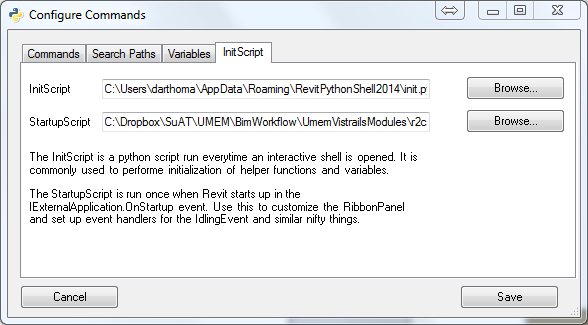

# InitScript, StartupScript

The *InitScript / StartupScript* tab lets you choose the *InitScript* and *StartupScript*. 



## InitScript

The *InitScript* is a script that is run whenever an interactive shell is opened. You can place imports, functions and variable definitions in the *InitScript* to make your life in interactive mode easier. Just keep in mind, that when you save code developed this way to a command (FIXME: external script?) you will need to add these to the external script.

The default contents of the *InitScript* are:

```python
# these commands get executed in the current scope
# of each new shell (but not for canned commands)
from Autodesk.Revit.DB import *
from Autodesk.Revit.DB.Architecture import *
from Autodesk.Revit.DB.Analysis import *

uidoc = __revit__.ActiveUIDocument
doc = __revit__.ActiveUIDocument.Document

from Autodesk.Revit.UI import TaskDialog
from Autodesk.Revit.UI import UIApplication


def alert(msg):
    TaskDialog.Show('RevitPythonShell', msg)


def quit():
    __window__.Close()
exit = quit


def get_selected_elements(doc):
    """API change in Revit 2016 makes old method throw an error"""
    try:
        # Revit 2016
        return [doc.GetElement(id)
                for id in __revit__.ActiveUIDocument.Selection.GetElementIds()]
    except:
        # old method
        return list(__revit__.ActiveUIDocument.Selection.Elements)
selection = get_selected_elements(doc)


#------------------------------------------------------------------------------
import clr
from Autodesk.Revit.DB import ElementSet, ElementId

class RevitLookup(object):
    def __init__(self, uiApplication):
        '''
        for RevitSnoop to function properly, it needs to be instantiated
        with a reverence to the Revit Application object.
        '''
        # find the RevitLookup plugin
        try:
			rlapp = [app for app in uiApplication.LoadedApplications
					 if app.GetType().Namespace == 'RevitLookup'
					 and app.GetType().Name == 'App'][0]
        except IndexError:
            self.RevitLookup = None
            return
        # tell IronPython about the assembly of the RevitLookup plugin
        clr.AddReference(rlapp.GetType().Assembly)
        import RevitLookup
        self.RevitLookup = RevitLookup
        # See note in CollectorExt.cs in the RevitLookup source:
        self.RevitLookup.Snoop.CollectorExts.CollectorExt.m_app = uiApplication
        self.revit = uiApplication

    def lookup(self, element):
        if not self.RevitLookup:
			print 'RevitLookup not installed. Visit https://github.com/jeremytammik/RevitLookup to install.'
			return
        if isinstance(element, int):
            element = self.revit.ActiveUIDocument.Document.GetElement(ElementId(element))
        if isinstance(element, ElementId):
            element = self.revit.ActiveUIDocument.Document.GetElement(element)
        if isinstance(element, list):
            elementSet = ElementSet()
            for e in element:
                elementSet.Insert(e)
            element = elementSet
        form = self.RevitLookup.Snoop.Forms.Objects(element)
        form.ShowDialog()
_revitlookup = RevitLookup(__revit__)
def lookup(element):
    _revitlookup.lookup(element)

#------------------------------------------------------------------------------

# a fix for the __window__.Close() bug introduced with the non-modal console
class WindowWrapper(object):
    def __init__(self, win):
        self.win = win

    def Close(self):
        self.win.Dispatcher.Invoke(lambda *_: self.win.Close())

    def __getattr__(self, name):
        return getattr(self.win, name)
__window__ = WindowWrapper(__window__)
```
The contents of this file sometimes changes from version to version of RevitPythonShell. You can always find the [newest version in the repository](https://raw.githubusercontent.com/architecture-building-systems/revitpythonshell/master/RevitPythonShell/init.py).

## StartupScript

The *StartupScript* is run when RevitPythonShell is first initialized as part of the `IExternalApplication.OnStartup` event, just after the RevitPythonShell ribbon has been populated. In addition to the standard RevitPythonShell variables available to external scripts, the *StartupScript* has access to `__uiControlledApplication__` the instance of `UIControlledApplication` passed to Revit `IExternalApplication` implementations. 

Possible, real-world uses for this include:

* creating custom ribbon panels (e.g. for deploying your addin)
* starting a web server (see chapter "Webserver example")
* unattended / "batch" processing of revit files

(FIXME: allow *multiple* StartupScripts and move to separate tab)

The initial *StartupScript* installed with RevitPythonShell looks like this:

```python
# script that is run when RevitPythonShell starts in the IExternalApplication.Startup event.
try:
    # add your code here
    # ...
    __window__.Close()  # closes the window 
except:
    import traceback       # note: add a python27 library to your search path first!
    traceback.print_exc()  # helps you debug when things go wrong
```

The contents of this file sometimes changes from version to version of RevitPythonShell. You can always find the newest version in the repository:
https://code.google.com/p/revitpythonshell/source/browse/trunk/RevitPythonShell/startup.py
